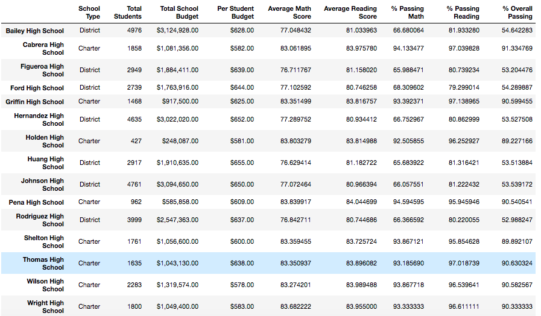
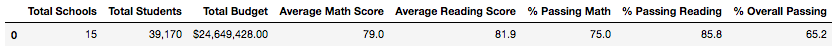

# School_District_Analysis
## Overview and Objective
#### To analyze the performance of 15 schools for 9th, 10th, 11th and 12th graders in a district through determination of key performance indicators based on students' reading and math scores

#### Compare these results with the results derived from the same dataset with the exclusion of one grade's scores (9th grade) from one school (Thomas High School) and its impact on overall metrics. 

## Results
#### School Summary including Thomas High School 9th grade student's math and reading scores


#### School Summary excluding Thomas High School 9th grade student's math and reading scores



As seen from above, there is a huge percentage increase in the % Passing Math (~ 26% increase), % Passing Reading (~ 27% increase), % Overall Passing (~26% increase) metrics for Thomas High School once the 9th graders are excluded from the analysis

#### Performance of THS relative to other schools including 9th grade math and reading scores


#### Performance of THS relative to other schools excluding 9th grade math and reading scores


As seen from the tables above, Thomas High School's position changes from being 8th in the performance table based on % Overall Passing scores, to being 2nd once the 9th grade scores are excluded

#### Approach and code snippets to exclude THS 9th grade math and reading scores from overall metrics

##### Get the number of 10th-12th graders from Thomas High School (THS).

 - THS 10th graders count
``` 
thomas_high_10th_graders_count = school_data_complete_df.loc[(school_data_complete_df['school_name'] == "Thomas High School") & (school_data_complete_df['grade'] == "10th"), ['Student ID']].count()
```
 - THS 11th graders count
``` 
thomas_high_11th_graders_count = school_data_complete_df.loc[(school_data_complete_df['school_name'] == "Thomas High School") & (school_data_complete_df['grade'] == "11th"), ['Student ID']].count()
```
 - THS 12th graders count
``` 
thomas_high_12th_graders_count = school_data_complete_df.loc[(school_data_complete_df['school_name'] == "Thomas High School") & (school_data_complete_df['grade'] == "12th"), ['Student ID']].count()
```
 - THS 10th-12th graders count
``` 
thomas_high_10th_to_12th_total_count = thomas_high_10th_graders_count + thomas_high_11th_graders_count + thomas_high_12th_graders_count
```
##### Get all the students passing math, reading and overall (both math and reading) from THS
``` 
thomas_high_students_passing_math = school_data_complete_df.loc[(school_data_complete_df['school_name'] == "Thomas High School") & (school_data_complete_df['math_score'] >= 70.0), ['school_name','Student ID','math_score']]

thomas_high_students_passing_reading = school_data_complete_df.loc[(school_data_complete_df['school_name'] == "Thomas High School") & (school_data_complete_df['reading_score'] >= 70.0), ['school_name','Student ID','reading_score']]

thomas_high_students_passing_math_reading = school_data_complete_df.loc[(school_data_complete_df['school_name'] == "Thomas High School") & (school_data_complete_df['math_score'] >= 70.0) & (school_data_complete_df['reading_score'] >= 70.0), ['school_name','Student ID','math_score','reading_score']]
```
##### Calculate the percentage of 10th-12th grade students passing math from Thomas High School. 

 - Count of 10th, 11th and 12th grade students passing math from Thomas High School
``` 
thomas_high_passing_math_10th_count = school_data_complete_df.loc[(school_data_complete_df['school_name'] == "Thomas High School") & (school_data_complete_df['math_score'] >= 70.0) & (school_data_complete_df['grade'] == "10th"), ['Student ID']].count()

thomas_high_passing_math_11th_count = school_data_complete_df.loc[(school_data_complete_df['school_name'] == "Thomas High School") & (school_data_complete_df['math_score'] >= 70.0) & (school_data_complete_df['grade'] == "11th"), ['Student ID']].count()

thomas_high_passing_math_12th_count = school_data_complete_df.loc[(school_data_complete_df['school_name'] == "Thomas High School") & (school_data_complete_df['math_score'] >= 70.0) & (school_data_complete_df['grade'] == "12th"), ['Student ID']].count()
```
 - Count of 10th-12th grade students passing math from Thomas High School
``` 
thomas_high_passing_math_10th_to_12th_count = thomas_high_passing_math_10th_count + thomas_high_passing_math_11th_count + thomas_high_passing_math_12th_count
```
 - Total number of students in Thomas High School
``` 
per_school_counts_thomas_high = school_data_complete_df.loc[(school_data_complete_df['school_name'] == "Thomas High School"), ['Student ID']].count()
```
 - Count of 9th grade students from Thomas High School
``` 
thomas_high_9th_graders_count = school_data_complete_df.loc[(school_data_complete_df['school_name'] == "Thomas High School") & (school_data_complete_df['grade'] == "9th"), ['Student ID']].count()
```
 - Count of 10th-12th grade students from Thomas High School
``` 
per_school_counts_thomas_high_new = per_school_counts_thomas_high - thomas_high_9th_graders_count
```
 - Percentage of 10th-12th grade students passing math from Thomas High School
``` 
thomas_high_passing_math_10th_to_12th_percentage = thomas_high_passing_math_10th_to_12th_count/float(per_school_counts_thomas_high_new) * 100
```
##### Calculate the percentage of 10th-12th grade students passing reading from Thomas High School. 

 - Count of 10th-12th grade students passing reading from Thomas High School
``` 
thomas_high_passing_reading_10th_count = school_data_complete_df.loc[(school_data_complete_df['school_name'] == "Thomas High School") & (school_data_complete_df['reading_score'] >= 70.0) & (school_data_complete_df['grade'] == "10th"), ['Student ID']].count()

thomas_high_passing_reading_11th_count = school_data_complete_df.loc[(school_data_complete_df['school_name'] == "Thomas High School") & (school_data_complete_df['reading_score'] >= 70.0) & (school_data_complete_df['grade'] == "11th"), ['Student ID']].count()

thomas_high_passing_reading_12th_count = school_data_complete_df.loc[(school_data_complete_df['school_name'] == "Thomas High School") & (school_data_complete_df['reading_score'] >= 70.0) & (school_data_complete_df['grade'] == "12th"), ['Student ID']].count()
```
 - Count of 10th-12th grade students passing reading from Thomas High School
```
thomas_high_passing_reading_10th_to_12th_count = thomas_high_passing_reading_10th_count + thomas_high_passing_reading_11th_count + thomas_high_passing_reading_12th_count
```
 - Percentage of 10th-12th grade students passing reading from Thomas High School
``` 
thomas_high_passing_reading_10th_to_12th_percentage = thomas_high_passing_reading_10th_to_12th_count/float(per_school_counts_thomas_high_new) * 100
```
##### Calculate the overall passing percentage of 10th-12th grade from Thomas High School. 

 - Count of 10th-12th grade students passing math and reading from Thomas High School
``` 
thomas_high_passing_math_reading_10th_count = school_data_complete_df.loc[(school_data_complete_df['school_name'] == "Thomas High School") & (school_data_complete_df['math_score'] >= 70.0) & (school_data_complete_df['reading_score'] >= 70.0) & (school_data_complete_df['grade'] == "10th"), ['Student ID']].count()
```
``` 
thomas_high_passing_math_reading_11th_count = school_data_complete_df.loc[(school_data_complete_df['school_name'] == "Thomas High School") & (school_data_complete_df['math_score'] >= 70.0) & (school_data_complete_df['reading_score'] >= 70.0) & (school_data_complete_df['grade'] == "11th"), ['Student ID']].count()
```
``` 
thomas_high_passing_math_reading_12th_count = school_data_complete_df.loc[(school_data_complete_df['school_name'] == "Thomas High School") & (school_data_complete_df['math_score'] >= 70.0) & (school_data_complete_df['reading_score'] >= 70.0) & (school_data_complete_df['grade'] == "12th"), ['Student ID']].count()
```
- Count of 10th-12th grade students passing math and reading from Thomas High School
``` 
thomas_high_passing_math_reading_10th_to_12th_count = thomas_high_passing_math_reading_10th_count + thomas_high_passing_math_reading_11th_count + thomas_high_passing_math_reading_12th_count
```
- Percentage of 10th-12th grade students passing math and reading from Thomas High School
``` 
thomas_high_passing_math_reading_10th_to_12th_percentage = thomas_high_passing_math_reading_10th_to_12th_count/float(per_school_counts_thomas_high_new) * 100
```
##### Replace the passing math percent for Thomas High School in the per_school_summary_df with the new passing math percentage.
``` 
per_school_summary_df.loc[['Thomas High School'], ['% Passing Math']] = float(thomas_high_passing_math_10th_to_12th_percentage) 
```
##### Replace the passing reading percentage for Thomas High School in the per_school_summary_df with the new passing reading percentage.
``` 
per_school_summary_df.loc[['Thomas High School'], ['% Passing Reading']] = float(thomas_high_passing_reading_10th_to_12th_percentage) 
```
##### Replace the overall passing percentage for Thomas High School in the per_school_summary_df with the new overall passing percentage.
``` 
per_school_summary_df.loc[['Thomas High School'], ['% Overall Passing']] = float(thomas_high_passing_math_reading_10th_to_12th_percentage)
```
##### District Summary
###### Including THS 9th grade math and reading scores



###### Excluding THS 9th grade math and reading scores


As seen from above, the % Passing Math, % Passing Reading, and % Overall Passing numbers for the district are marginally higher when including THS 9th grade math and reading scores, but once they are changed to NaN values, there is a marginal drop in the percentages of the 3 metrics.

###### Math and Reading scores by grade including 9th grade scores
[Math scores by grade]()

[Reading scores by grade]()

###### Math and Reading scores by grade excluding 9th grade scores
[Math scores by grade]()

[Reading scores by grade]()


## Overall Summary
